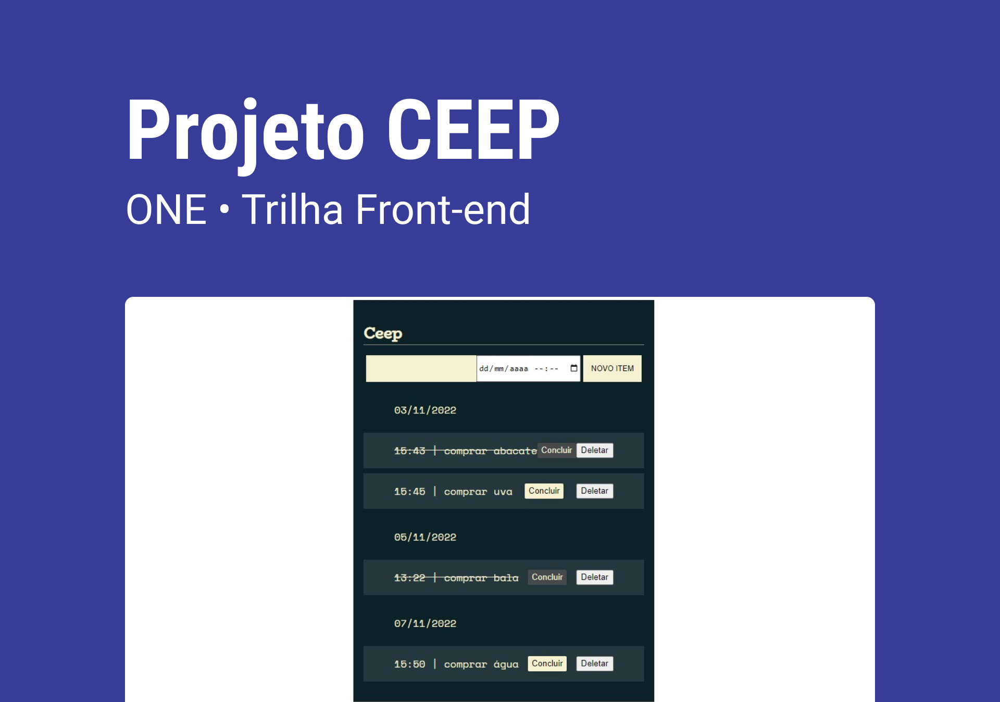

<h1 align="center"> CEEP </h1>

O projeto CEEP foi desenvolvido no curso JS na Web: Manipule o DOM com JavaScript e JS na Web: Armazenando dados no navegador, promovido pela Alura + ONE.

  <a href="#-tecnologias">Tecnologias</a>&nbsp;&nbsp;&nbsp;|&nbsp;&nbsp;&nbsp;
  <a href="#-projeto">Projeto</a>&nbsp;&nbsp;&nbsp;|&nbsp;&nbsp;&nbsp;
  <a href="#memo-licença">Licença</a>

 

  

## 🚀 Tecnologias

Esse projeto foi desenvolvido com as seguintes tecnologias:

- HTML e CSS
- JavaScript
- Git e GitHub

## 💻 Projeto

O CEEP é um projeto que armazena e controla tarefas que o usuário deseja guardar.

## :memo: Licença

Esse projeto está sob a licença MIT.

---

Feito com ♥ by Marcos Allan :wave: [Meu LinkedIn!](https://www.linkedin.com/in/dev-marcos-allan)
